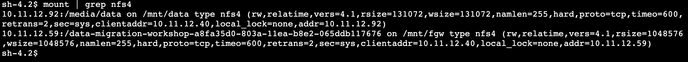

# **AWS DataSync** - NFS server migration using AWS DataSync and AWS Storage Gateway

# Module 3
## Access S3 bucket on-premises using File Gateway

You now have the files from the NFS server copied to your S3 bucket.  In this module, you will configure the File Gateway in the ON-PREMISES region to connect to your S3 bucket and provide access to the files in the bucket through an NFS share.  You will mount the File Gateway share on the Application server to validate access to the files.

## Module Steps

#### 1. Activate the File Gateway

Just as you activated the DataSync agent in the previous module, you need to perform a similar step for the File Gateway, activating it in the **IN-CLOUD** region.  Follow the steps below to activate the gateway.

1. Go to the AWS Management console page in the **IN-CLOUD** region and click  **Services**  then select  **Storage Gateway.**

2. If no gateways exist, click the **Get started** button, otherwise click the **Create gateway** button.
3. Enter `onprem-s3-file-gateway` as gateway name.
4. Select the **S3 File gateway** gateway type.
5. Select **Amazon EC2** as the host platform.
6. Under **Launch EC2 instance**, select **Customize your settings**. And under **Confirm set up gateway**, tick **I completed all the steps above and launched the EC2 instance.** checkbox. Then click **Next**.

7. Enter the **Public IP address** of the File Gateway instance that was created in the first module using CloudFormation.  Click **Connect to gateway**.
8. Select the **Publicly accessible** service endpoint type, then click **Next** to Review and activate.
9. Under **Review and activate** tab, Click **Activate gateway** button.
10. The gateway will be activated and then it will spend a minute or so preparing the local disk devices.  Allocate the **300 GiB /dev/xvdc** device to **Cache.**  This is the local disk on the gateway that will be used to cache frequently accessed files.

  

11. On the **CloudWatch log group** panel select **Deactivate logging** and click **Configure**.
12. From the main Storage Gateway page, you will see your gateway listed.

  

#### 2. Storage Gatway > Create File share

1. In **File shares**, click on the **Create file share** button.
2. Select the Gateway that was just created.
3. Select **NFS** as file share protocol.
4. For the **Amazon S3 bucket name** , select the S3 bucket that DataSync copied the files to.  You can find the bucket name in the outputs of the CloudFormation stack in the **IN-CLOUD** region.

5. Click **Customize configuration**.

  

6. Enter file share name as `onprem-s3-fileshare`.
7. Keep the default settings, then click **Next**.
8. Under **Amazon S3 storage settings**, keep **S3 Standard** for storage class, then click **Next**.
9. Under the **Allowed clients** section, add the **Private IP Address** of the Application server, followed by "/32".  This will only allow the Application server to access the NFS file share on the gateway.
10. Under the **Mount options** section, change the **Squash level** to `No root squash`.
11. Click **Create file share**.
12. Wait for the status to change to **Available**.
13. Select the new file share and note the mount instructions.

  
  
  

#### 3. Mount the NFS share on the Application server

1. Return to the CLI for the Application server and run the following command to create a new mount point for the File Gateway share:

        $ sudo mkdir /mnt/fgw

2. Copy the Linux mount command from the Storage Gateway file share page and replace &quot;[MountPath]&quot; with &quot;/mnt/fgw&quot;.   **You must run the command as sudo.**
3. You should now have two NFS mount points on your Application server: one for the on-premises NFS server (mounted at /mnt/data) and one for the File Gateway (mounted at /mnt/fgw).

  

## Validation Step

Run the following command to verify that the same set of files exist on both NFS shares.

    $ diff -qr /mnt/data /mnt/fgw

You should see only one extra file in /mnt/fgw: .aws-datasync-metadata.  This file was created by DataSync in the S3 bucket when the task was executed.  All other files are the same, indicating that our data was fully transferred by DataSync without errors.

## Module Summary

In this module you successfully activated the File Gateway and created an NFS file share on the gateway.  You then mounted the share on the Application server and verified that the files from the on-premises NFS server were copied correctly to the S3 bucket.

Remember that our ultimate goal in this workshop is to shut off the on-premises NFS server and free up storage resources.  In a production environment, this would typically involve a &quot;cutover point&quot;, where there is momentary downtime as the Application server changes over to the new storage, which in this workshop is the File Gateway NFS share.  However, there are usually new files being created while a migration occurs, or shortly after, requiring another incremental file copy before cutover.

In the next module, you&#39;ll do one more incremental copy before the final cutover to the File Gateway share.

Go to [Module 4](../module4/).
