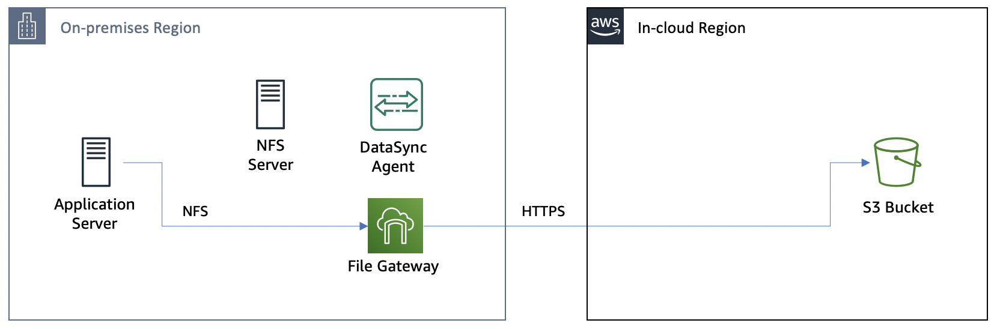
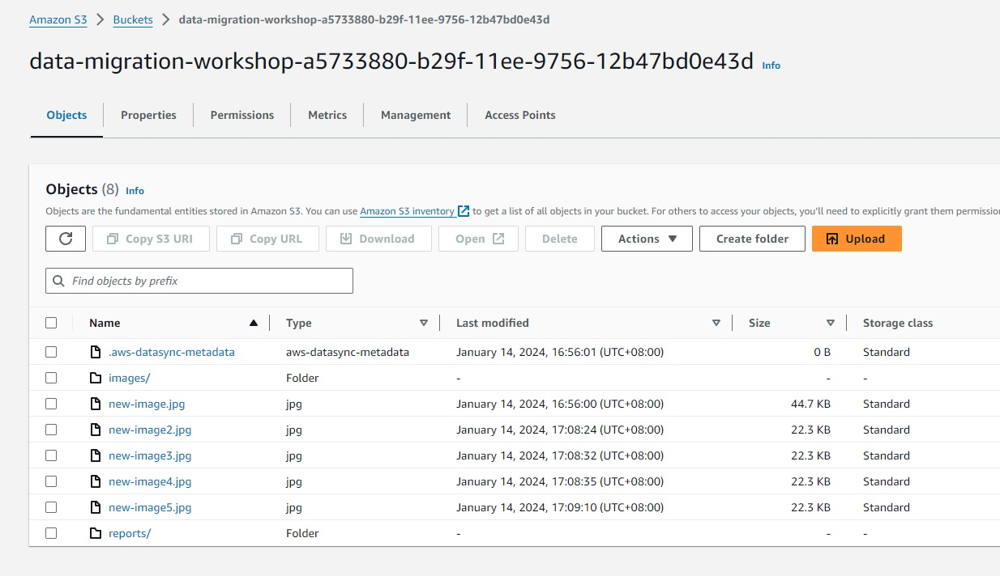

# **AWS DataSync** - NFS server migration using AWS DataSync and AWS Storage Gateway

# Module 5
## Cutover to File Gateway and shutdown the NFS server

With all of the data in the S3 bucket, you are now ready to shut down your NFS server and move exclusively to using the File Gateway.  In this module, you will unmount the NFS server and clean up your DataSync resources.  You will then write some test files through File Gateway, verifying they end up in the S3 bucket.

## Module Steps

#### 1. Unmount the NFS server

1. From the CLI for the Application server, run the following command to unmount the NFS server:

        $ sudo umount /mnt/data

#### 2. Clean up DataSync resources

You&#39;re done with DataSync so you can go ahead and clean up resources.

1. Go to the **IN-CLOUD** region AWS management console and go to the **DataSync** service.

2. Select **Tasks** and delete the task you created previously
3. Select **Locations** and delete the locations you created previously
4. Select **Agents** and delete the agent you activated previously.  Note that this **will not** delete the actual DataSync agent EC2 instance.  That will get deleted later, when the CloudFormation stack is deleted.
5. Stop **DataSyncAgent** EC2 instance to reduce billable cost.

## Validation Step

From the CLI for the Application server, run the following command to create another new file in the S3 bucket through the File Gateway:

    sudo cp /mnt/fgw/images/00002.jpg /mnt/fgw/new-image2.jpg
    sudo cp /mnt/fgw/images/00002.jpg /mnt/fgw/new-image3.jpg
    sudo cp /mnt/fgw/images/00002.jpg /mnt/fgw/new-image4.jpg
    sudo cp /mnt/fgw/images/00002.jpg /mnt/fgw/new-image5.jpg

Go back to the IN-CLOUD region management console and go to **S3**.  Select the **data-migration-workshop** bucket.  You should see the new-image2.jpg file in the bucket.

Your Application server has completed cutover!  You can now read all of the files that used to be on the NFS server using the File Gateway share.  And any new files written to the share will automatically be uploaded to the S3 bucket.  You can now shutdown and decommission your NFS server!

One of the benefits of using File Gateway is that it stores files as complete, wholly accessible objects in S3.  With your data is in S3, you can now use services such as Amazon Athena, Amazon SageMaker, Amazon EMR, and many other AWS services to gain even greater value and insight from your data.

## Workshop Cleanup

To make sure all resources are deleted after this workshop scenario make sure you execute the steps in the order outlined below (you do not need to wait for CloudFormation to finish deleting before moving to the next step):

1. Unmount the File Gateway NFS share on the Application server by running the following command:

        sudo umount /mnt/fgw

2. Close the browser window running the CLI.
3. Go to the Storage Gateway page in the IN-CLOUD region and delete the File Gateway **NFS file share** in the IN-CLOUD region
4. Delete the File Gateway in the IN-CLOUD region named **DataMigrationGateway**.  Note this will not delete the gateway EC2 instance.  The instance will get deleted when the CloudFormation in the ON-PREMISES region is deleted.
5. Go to the CloudFormation page in the IN-CLOUD region and delete the stack named &quot;DMW-CLOUD&quot;
6. Go to the CloudFormation page in the ON-PREMISES region and delete the stack named &quot;DMW-ONPREM&quot;
7. (Optional) Delete **Log groups** from CloudWatch Logs.

To make sure that all CloudFormation templates have been deleted correctly, confirm that all EC2 instances created in this workshop in the ON-PREMISES region are in the **terminated** state.
