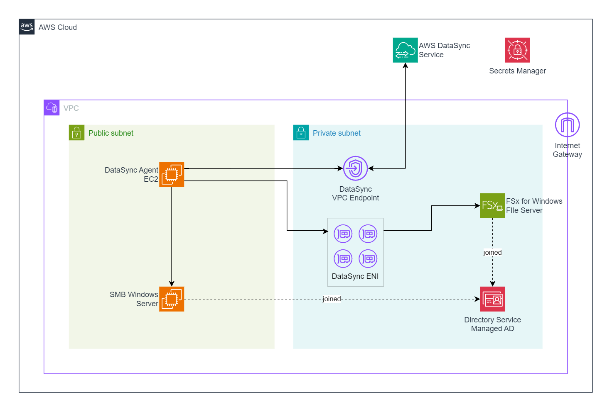

# **AWS DataSync** - Migrate to FSx Windows File Server using AWS DataSync

Forked and modified from https://github.com/aws-samples/aws-datasync-fsx-windows-migration/tree/master

## Workshop scenario

In your data center, you have a Windows Server that is starting to age out.  This server provides user shares and home directories for groups within your organization.  To reduce your data center footprint and to free up resources, you would like to move the data on the Windows Server into the AWS cloud.

After doing some research, you have learned that you can use [AWS DataSync](https://aws.amazon.com/datasync/) to migrate the data from your on-premises Windws Server to [Amazon FSx for Windows File Server](https://aws.amazon.com/fsx/windows/).

This workshop will walk you through this scenario, using a CloudFormation template to deploy resources and the AWS Management console to configure those resources accordingly.

## Topics covered

- Deploying resources using CloudFormation.
- Creating and managing FSx for Windows File Server shares.
- Using AWS DataSync to copy data from a Windows Server to FSx.
- Using AWS DataSync in a more secure environment, not exposed to internet.
- Deploying all resources in private subnets only, not using any Elastic IPs / Public IPs.
- Using Fleet Manager Remote Desktop to connect to all Windows VM(s).
- Deploying all the required VPC Endpoints for private connectivity.

## Prerequisites

### AWS Account

In order to complete this workshop, you will need an AWS account with rights to create AWS IAM roles, EC2 instances, FSx file systems, DataSync agents, and CloudFormation stacks in the AWS regions you select.

### Software

- **Internet Browser**  – It is recommended that you use the latest version of Chrome or Firefox for this workshop.

## Workshop modules

This workshop consists of the following modules:

- [Module 1](module1) - Deploy resources using CloudFormation
- [Module 2](module2) - Configure file shares on the Windows Server and FSx
- [Module 3](module3) - Copy files from the Windows Server to FSx using DataSync
- [Module 4](module4) - Cleanup resources

To get started, go to [Module 1](module1).

## High-Level Diagram

*Architecture diagram overview*

### Resources
1. EC2 - App Server  
    - connect to `SMB File Server` on TCP 445 (SMB).
    - connect to `FSx for Windows` on TCP 445 (SMB).
1. EC2 - AWS DataSync Agent EC2  
    - connect to `SMB File Server` on TCP 445 (SMB).
1. EC2 - SMB File Server (Windows Server 2016)
1. Directory Service - Managed AD
1. FSx for Windows File Server
1. Secrets Manager
1. VPC Resources: VPC, subnets, route tables, security group, internet gateway
1. VPC Endpoint for DataSync
1. VPC Endpoint for Secrets Manager, CloudFormation, S3
1. VPC Endpoint for Fleet Manager: SSM, SSMMessage, EC2Message
1. AWS DataSync
    - Agent
    - Location: Source (SMB) and Destination (FSx)
    - Task

### Security Group

1. DataSync Agent EC2 Security Group  
    **Inbound rules**  
    - NONE

    **Outbound rules**  
    - Default rules

1. App Server Security Group  

    **Inbound rules**  
    - NONE

    **Outbound rules**  
    - Default rules

1. SMB Windows Server Security Group  

    **Inbound rules**  
    - Allow TCP 445 from `DataSync Agent EC2` Security Group
    - Allow TCP 445 from `App Server` Security Group

    **Outbound rules**  
    - Default rules

1. FSx for Windows Security Group  
    **Inbound rules**  
    - Allow TCP 139 from VPC CIDR
    - Allow TCP 53/UDP 53 from VPC CIDR
    - Allow TCP 445 from `DataSync Task Network Interfaces` Security Group
    - Allow TCP 445 from `App Server` Security Group

    **Outbound rules**  
    - Default rules

1. DataSync Task Network Interfaces Security Group  

    **Inbound rules**  
    - Allow TCP 443 from `DataSync Agent EC2` Security Group

    **Outbound rules**  
    - Default rules

1. DataSync VPC Endpoint Security Group  

    **Inbound rules**  
    - Allow TCP 443 from `DataSync Agent EC2` Security Group
    - Allow TCP 1024-1064 from `DataSync Agent EC2` Security Group

    **Outbound rules**  
    - Default rules

1. (General) VPC Endpoint Security Group  

    **Inbound rules**  
    - Allow TCP 443 from VPC CIDR

    **Outbound rules**  
    - Default rules

## Cost

It will cost approximately **10.00 USD** to run this workshop.  It is recommended that you follow the cleanup instructions once you have completed the workshop to remove all deployed resources and limit ongoing costs to your AWS account.

## Related workshops

- [NFS server migration using AWS DataSync and Storage Gateway](https://github.com/aws-samples/aws-datasync-migration-workshop/blob/master/workshops/nfs-migration)
- [Migrate millions of files using AWS DataSync](https://github.com/aws-samples/aws-datasync-migration-workshop/blob/master/workshops/nfs-million-files)
- [Get hands-on with online data migration options to simplify & accelerate your journey to AWS](https://github.com/aws-samples/aws-online-data-migration-workshop)

## References

- [DataSync network requirements](https://docs.aws.amazon.com/datasync/latest/userguide/datasync-network.html)
- [How AWS DataSync transfers work](https://docs.aws.amazon.com/datasync/latest/userguide/how-datasync-transfer-works.html)
