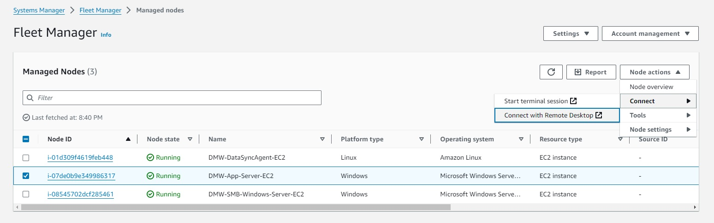
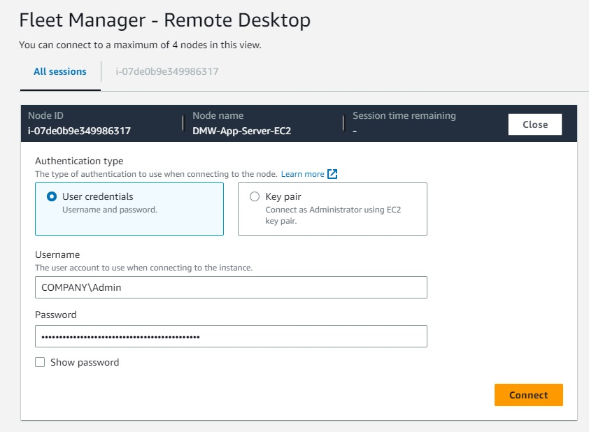
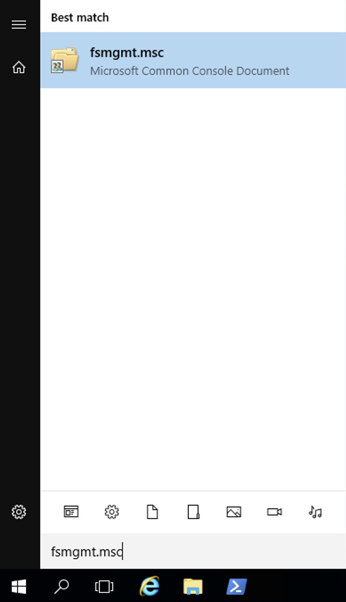

# **AWS DataSync** - Migrate to FSx Windows File Server using AWS DataSync

# Module 2
## Configure file shares on the Windows Server and FSx

In the previous module, you deployed various AWS resources using CloudFormation.  This included an Active Directory domain using AWS Managed Microsoft AD, a Windows Server, and an FSx for Windows file system.  As part of the deployment of the Windows Server, a small folder structure was setup that simulates a basic departmental share.  In this module, you will create a share on the Windows Server for this folder.  You will also create a new share on the FSx for Windows file server and verify that security settings and permissions are configured appropriately.  Once these steps are complete, you will then be ready to copy data from the Windows Server to FSx, using AWS DataSync.

## Module Steps

### 1. Login to the Windows Server
To login to the Windows Server, you will use Fleet Manager.

1. Go to the [Systems Manager](https://console.aws.amazon.com/systems-manager/home) > [Fleet Manager](https://console.aws.amazon.com/systems-manager/fleet-manager/managed-nodes), select the **DMW-Windows-Client-EC2** instance, and click on the **Node actions > Connect > Connect with Remote Desktop**.

    

2. Select User credentials, enter username "COMPANY\Admin", replacing "COMPANY" with the NetBIOS name of your domain.  Use the common password you entered when creating the CloudFormation stack.  You can find both the NetBIOS name and the password in the CloudFormation outputs.

    

### 2. Explore the Departmental folder

1. From the Fleet Manager - Remote Desktop instance, open File Explorer and navigate to the private IP of the SMB-Windows-Server - `\\SMB-Windows-PrivateIP\share1`.  At the top-level of the C: drive, you should see a folder named "share1".  Our goal for this workshop is to copy the contents of the share1 folder to FSx.

2. Right-click on the share1 folder, select **Properties**, click on the **Security** tab, then click on the **Advanced** button.  This will display information about the permissions on the share1 folder.  This is one way to view the Access Control List (ACL) for a file or folder.

    

    You can see that there are three permission entries on this folder: one for the Windows SYSTEM user, one for the Active Directory Domain Users group, and one for a group called AWS Delegated FSx Administrators.  This last group is created automatically by the AWS Managed AD service and has rights similar to the Domain Admins group.

    At the top of the window, you can also see the owner of the folder, which in this case is the Active Directory Admin user.  In most cases, the Owner of a folder or file will be the name of the account that created it.

4. Close the security windows and open the share1 folder. You should see four folders: Finance, HR, Legal, Shared. Each directory has a few sub-folders and files.

    

    As you did in the previous step, right-click on one of the directories to view the security properties.  For example, here is what you should see for the Finance folder:

    

    Notice that there is no longer an entry for Domain Users and that there is a new entry for the Finance group.  In this case, the Finance folder contains data that only members of the Finance group should see, not all Domain Users.

So why do you care about security permissions on files?  One of the key benefits of AWS DataSync is that it copies not only file data, but permissions, timestamps, and other file and folder metadata.  In fact, AWS DataSync makes an exact copy of your file system on the destination (in this case, FSx).  This functionality is critical when migrating data from one place to another and DataSync takes care of all of this for you.

5. You can also add more files to `\\SMB-Windows-PrivateIP\share1` folder.

### 3. Create a new file share on FSx

When you create a new FSx file server, it automatically creates a network share named "share".  To show you how to manage FSx file shares, we'll go ahead and create a new share using the steps below.  You can also check out the [FSx documentation](https://docs.aws.amazon.com/fsx/latest/WindowsGuide/managing-file-shares.html) for further details.

1. Click on the Windows launch icon and type in "fsmgmt.msc" to launch the Shared Folders dialog box.

    

2. Connect to the FSx server to see those shares by right-clicking on "Shared Folders (Local)" and selecting "Connect to another computer ..."

    

    Select "Another computer" and enter the DNS name of the FSx file server.  You can find the DNS name of the file server by selecting your file system from the AWS management console for FSx, and then clicking on the **Network & security** tab.

    

    Copy the DNS name and enter it into the dialog box, then click on OK.

    

4. In the Shared Folders dialog box, right-click on Shares and select **New Share...**, then click **Next**.
5. For **Folder path** enter "D:\share1", then click **Next**.  When prompted to create the folder, click **Yes**.
6. Leave the default settings for the share and click **Next**.
7. For the permissions, select **Customize permissions** and click on the **Custom..** button.
8. On the **Share Permissions** tab, make sure the Everyone group is selected and check the box under "Allow Full Control".

    

    Once the Share Permissions are modified, click **OK**.
9. Back in the Shared Folder Wizard, click on the **Finish** button to create the new share and then click on **Finish** one more time.  You should now see the share1 network share in the list.

    

## Validation Step

To verify that data ultimately gets copied to FSx, go ahead and mount the new FSx share on the Windows Server.  Open File Explorer, right click on **This PC** and select **Map network drive...**

For the share folder, enter "\\\\" followed by the DNS name of the FSx file system, followed by "\share1", then click the **Finish** button.

You should see an empty folder in File Explorer.

## Module Summary

In this module, you explored the `share1` folder on the Windows Server and looked at how the permissions are configured.  You then created a network share on the Windows Server to make the `share1` folder available over the network.  Finally, you created a new share on FSx and mapped it to the Windows Server.

In the next module, you will create a DataSync task and run it to copy the share folder contents from the Windows Server to the FSx file system.

Go to [Module 3](../module3).
