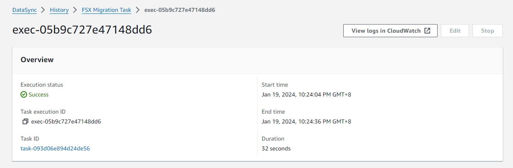

# **AWS DataSync** - Migrate to FSx Windows File Server using AWS DataSync

# Module 3
## Copy files from the Windows Server to FSx using DataSync

In the previous module, you created network shares on both the Windows Server and FSx.  AWS DataSync uses network shares to access data on file systems.  In this module, you will prepare DataSync for the transfer. First, you will setup CloudWatch so that it can accept logs from DataSync.  You will then activate your DataSync agent and configure it for VPC access.  You will then configure DataSync with a new task that will copy data from the Windows Server to FSx.

## Module Steps

### 1. Configure CloudWatch to allow DataSync logging

When you create a DataSync task, it can be configured to write logs to a CloudWatch log group.  If there are any issues during the transfer then a log entry will be created for each problematic file, allowing you to investigate once the DataSync task completes.  However, before DataSync can write logs to CloudWatch, it must first be configured with the proper resource policy. Note that the steps below only need to be done once per AWS region where you will run DataSync.

1. Copy the text for the policy below into an editor and save it as a file on your local machine:

        {
            "Statement": [
                {
                    "Sid": "DataSyncLogsToCloudWatchLogs",
                    "Effect": "Allow",
                    "Action": [
                        "logs:PutLogEvents",
                        "logs:CreateLogStream"
                    ],
                    "Principal": {
                        "Service": "datasync.amazonaws.com"
                    },
                    "Resource": "*"
                }
            ],
            "Version": "2012-10-17"
        }

2. From your command-line terminal, run the following command to apply the policy to CloudWatch:

        aws logs put-resource-policy --region <region> --policy-name trustDataSync --policy-document file://<full-path-to-policy-file>

  where `<full-path-to-policy-file>` is the file on your local machine that was created in step #1 above and `<region>` is the AWS region you are using for the workshop.

## Manual Method for Step 2-5

### 2. Activate the DataSync agent

Although the EC2 instance running the DataSync agent was deployed in the first module, before they can be used they first need to be activated.  Follow the steps below to activate the agent.

1. Go to the AWS Management console page, click  **Services**, then select  **DataSync.**
2. If no DataSync agent exists, click the **Get started** button, otherwise click the **Create agent** button.
3. Select **Amazon EC2** hypervisor. 
3. For the Service endpoint, select **VPC endpoints using AWS PrivateLink**.  This will limit all DataSync traffic to the VPC in which the agent is running.  This is useful when you have an AWS DirectConnect or VPN connection from your on-premises environment into AWS.  For more information on configuring DataSync for VPC access, check out [this documentation](https://docs.aws.amazon.com/datasync/latest/userguide/datasync-in-vpc.html).
4. For the VPC Endpoint, select the endpoint ID that matches the ID in the CloudFormation outputs tab.  The VPC has only one subnet and one security group - both will automatically be selected for you.

    

5. Retrieve Activation key from EC2

    - Connect to **DataSyncAgent-EC2**.  
    

    - In Systems Manager shell, enter  

            sudo su - admin

    - Enter `0` in the prompt for '**Get activation key**'

    

    - Enter **AWS Region** that you use for this workshop.
    - Select `3` for VPC Endpoints.
    - Retrieve DataSync VPC Endpoint IP Address from **VPC Console > Endpoints**, and enter the private ip.
    - Copy the **Activation key**.

    

4. Under the **Activation key** section, select the **Manually enter your agent's activation key**. Enter the activation key. 
5. Enter **Agent name** as `FSX DataSync Agent`. 

    

6. Click **Create agent** button.

    

### 3. Create the source location

DataSync copies data from a source location to a destination location.  Locations exist independent of tasks and can be re-used if needed.

1. On the left side of the page, select **Locations** then click on the **Create location** button.
2. Under the **Location Type** select "Server Message Block (SMB)".
3. Select the agent you just created in the previous step.  Under **SMB Server**, enter the **Private IP address** of the `DMW-SMB-Windows-Server-EC2`, which you can find in the CloudFormation outputs.  Under **Share name** enter "/share1".

    

4. Under **User settings**, for **User**, enter "datasync".  For **Password** enter the common password you created as part of CloudFormation.  For **Domain** enter the full domain name, found in the CloudFormation outputs.  These are the user credentials that AWS DataSync will use to access the network share on the SMB Windows Server.

    

5. Click on **Create location**

The **datasync** AD user was created automatically in the CloudFormation stack and has been configured to be part of the **AWS Delegated FSx Administrators group**.  This is important because the user that DataSync uses must have the rights to read and set all fields of the ACL.  In an AWS Managed AD environment, the **AWS Delegated FSx Administrators group** provides such rights.  In a self-managed AD environment, such rights come through the Domain Admins group or the Backup Operators group.

### 4. Create the destination location

1. On the left side of the page, select **Locations** then click on the **Create location** button.
2. Under the **Location Type** select "Amazon FSx for Windows File Server".
3. Select the FSx file system named "DataSync FSx Workshop".
4. For the **Share name** enter "/share1".
5. Expand **Additional settings**.  Remove the default security group and select the security group named "DMWFSX-locationFsxSecurityGroup". 

    

5. Under **User settings** use the same credentials you provided for the Source location for the `DMW-SMB-Windows-Server-EC2`.
6. Click on **Create location**.

When working with VPC Endpoints, DataSync will create ENI (Elastic Network Interface) based on the information we provided in destination location. You can read more in this doc - [DataSync network requirements > VPC Endpoints](https://docs.aws.amazon.com/datasync/latest/userguide/datasync-network.html#using-vpc-endpoint).  To check ENI created, you can navigate to **EC2 console > Network Interfaces**, and look for `locationfsx`.

  

### 5. Create the DataSync task

1. Click on the **Create task** button
2. Select "Choose and existing location" and then select the SMB location you created earlier.  This is the source location - SMB Windows Server.
3. Click **Next**
4. Select "Choose an existing location" and then select the FSx location you created earlier.  This is the destination location - FSx.
5. Click **Next**
6. Give the task a name.  Under the Verify data option, make sure that "Verify only the data transferred" option is selected.  This will verify data at the destination in the most optimal way.  Leave the other Options as-is.

    

7. Scroll down to the **Task logging** section.  Under **Log level**, select "Log all transferred objects and files".  Under **CloudWatch Log group**, select the group named "DataSyncLogs-MigrationWorkshop".

    

8. Click **Next**.
9. Verify all task settings then click on **Create task**.

## Alternative Method for Step 2-5 (using Cloudformation)

### 2. Retrieve Activation key from EC2

Although the EC2 instance running the DataSync agent was deployed in the first module, before they can be used they first need to be activated.  Follow the steps below to activate the agent.

  - Connect to **DataSyncAgent-EC2**.  
    

  - In Systems Manager shell, enter  

            sudo su - admin

  - Enter `0` in the prompt for '**Get activation key**'

    

  - Enter **AWS Region** that you use for this workshop.
  - Select `3` for VPC Endpoints.
  - Retrieve DataSync VPC Endpoint IP Address from **VPC Console > Endpoints**, and enter the private ip.
  - Copy the **Activation key**.

    

### 3. Create DataSync resources - Agent, Source location and Destination location, and Task

1. Click one of the launch links in the table below to deploy datasync resources using CloudFormation. Select the **same region** where you deployed your resources in [Module 1](../module1/).

  | **Region Code** | **Region Name** | **Launch** |
  | --- | --- | --- |
  | us-east-1 | US East (N. Virginia) | [Launch in us-east-1](https://console.aws.amazon.com/cloudformation/home?region=us-east-1#/stacks/new?stackName=DMWFSX-DataSync&amp;templateURL=https://workshop-cfn-samples.s3.us-west-1.amazonaws.com/datasync-fsx-migration/11-datasync-workload.yml) |
  | us-east-2 | US East (Ohio) | [Launch in us-east-2](https://console.aws.amazon.com/cloudformation/home?region=us-east-2#/stacks/new?stackName=DMWFSX-DataSync&amp;templateURL=https://workshop-cfn-samples.s3.us-west-1.amazonaws.com/datasync-fsx-migration/11-datasync-workload.yml) |
  | us-west-2 | US West (Oregon) | [Launch in us-west-2](https://console.aws.amazon.com/cloudformation/home?region=us-west-2#/stacks/new?stackName=DMWFSX-DataSync&amp;templateURL=https://workshop-cfn-samples.s3.us-west-1.amazonaws.com/datasync-fsx-migration/11-datasync-workload.yml) |
  | eu-west-1 | Ireland | [Launch in eu-west-1](https://console.aws.amazon.com/cloudformation/home?region=eu-west-1#/stacks/new?stackName=DMWFSX-DataSync&amp;templateURL=https://workshop-cfn-samples.s3.us-west-1.amazonaws.com/datasync-fsx-migration/11-datasync-workload.yml) |
  | eu-west-2 | London | [Launch in eu-west-2](https://console.aws.amazon.com/cloudformation/home?region=eu-west-2#/stacks/new?stackName=DMWFSX-DataSync&amp;templateURL=https://workshop-cfn-samples.s3.us-west-1.amazonaws.com/datasync-fsx-migration/11-datasync-workload.yml) |
  | eu-central-1 | Frankfurt | [Launch in eu-central-1](https://console.aws.amazon.com/cloudformation/home?region=eu-central-1#/stacks/new?stackName=DMWFSX-DataSync&amp;templateURL=https://workshop-cfn-samples.s3.us-west-1.amazonaws.com/datasync-fsx-migration/11-datasync-workload.yml) |
  | eu-south-1 | Milan | [Launch in eu-south-1](https://console.aws.amazon.com/cloudformation/home?region=eu-south-1#/stacks/new?stackName=DMWFSX-DataSync&amp;templateURL=https://workshop-cfn-samples.s3.us-west-1.amazonaws.com/datasync-fsx-migration/11-datasync-workload.yml) |
  | ap-northeast-1 | Tokyo | [Launch in ap-northeast-1](https://console.aws.amazon.com/cloudformation/home?region=ap-northeast-1#/stacks/new?stackName=DMWFSX-DataSync&amp;templateURL=https://workshop-cfn-samples.s3.us-west-1.amazonaws.com/datasync-fsx-migration/11-datasync-workload.yml) |
  | ap-southeast-1 | Singapore | [Launch in ap-southeast-1](https://console.aws.amazon.com/cloudformation/home?region=ap-southeast-1#/stacks/new?stackName=DMWFSX-DataSync&amp;templateURL=https://workshop-cfn-samples.s3.us-west-1.amazonaws.com/datasync-fsx-migration/11-datasync-workload.yml) |
  | ap-southeast-2 | Sydney | [Launch in ap-southeast-2](https://console.aws.amazon.com/cloudformation/home?region=ap-southeast-2#/stacks/new?stackName=DMWFSX-DataSync&amp;templateURL=https://workshop-cfn-samples.s3.us-west-1.amazonaws.com/datasync-fsx-migration/11-datasync-workload.yml) |

2. Click **Next** on the Create Stack page.
3. Keep the Stack Name as-is. Under the **Parameters** section, enter datasync activation key that you get from EC2. Click **Next**.
4. Click **Next** again. (skipping the Options and Advanced options sections)
5. On the Review page, scroll to the bottom and check the box to acknowledge that CloudFormation will create IAM resources, then click  **Create stack**.
6. Wait for the CloudFormation stack to reach the **CREATE_COMPLETE**.
7. Head to [DataSync](https://console.aws.amazon.com/datasync/home) page, and verify all resources are created - Agent, Source location and Destination location, and Task.

---

### 6. Run the DataSync task

1. Wait for the **Task status** to transition from "Creating" to "Available".
2. To run the task, click the **Start** button, verify the settings one more time, and then click **Start**.
3. The task will immediately go into the &quot;Running&quot; state.
4. Under the **History** tab, click on the task execution object in the list.
5. As the task runs, the execution status will progress from &quot;Launching&quot; to &quot;Preparing&quot; to &quot;Transferring&quot; to &quot;Verifying&quot; and finally to &quot;Success&quot;.  Once the task completes, the console will report statistics on the job, as shown below.

    
    

## Validation Step

Return to the Windows Server remote desktop session.  In the File Explorer window for the FSx share, you should now see an exact copy of the files and folders from the `share1` folder on the source SMB Windows Server.  You should also see a folder name `.aws-datasync`, which was created by DataSync as part of the migration process.

  

If you check the security properties on the various files and folders you will find that they exactly match those on Windows Server `share1` folder.

## Module Summary

In this module, you configured DataSync, activated your agent, and then successfully made a full copy of data from the Windows Server to the FSx file system.  After the copy was complete, you validated that the data was successfully copied to FSx.

While this workshop only copied a small amount of data into FSx, DataSync is built to scale easily and efficiently.  AWS customers have used DataSync to copy petabytes of data from on-premises systems into AWS cloud storage, including Amazon S3, Amazon EFS, and Amazon FSx.  Head to the [DataSync product pages](https://aws.amazon.com/datasync/) to learn more about how AWS DataSync can help you with your data migration projects.

In the next module, you will cleanup all resources created in this workshop.

Go to [Module 4](../module4).
